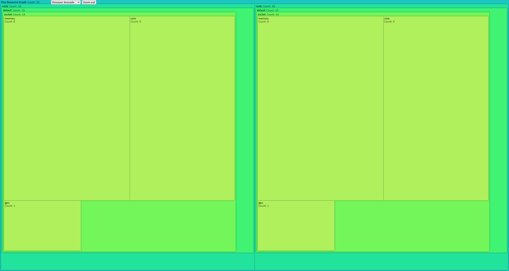

# Flux d3 Visualization

This is a (static) example of (what could be) an interactive tool and/or server
to easily visualize resource graphs - an idea for [this issue](https://github.com/flux-framework/flux-core/issues/2162). 
Here we are using d3!

⭐️ [Demo](https://researchapps.github.io/flux-vis/d3/) ⭐️

## Usage

Currently, you can generate any of the data files that can populate the UI as follows:

```bash
$ python generate.py resources/simple.yaml
```

This will write the yaml file in resources into [data](data), and you can
do this for more than one yaml file. If we turned this into a production tool,
I would either have it run a small server (to interactively select a file)
and likely do the conversion on the fly (as a part of that). We could probably
get fancy and use WebAssembly too, in which case we wouldn't need the server.



In practice, it looks OK for the simple example, but the cluster and birack don't
look right because of the relative scaling (the children entities having much larger
counts than the parents).
