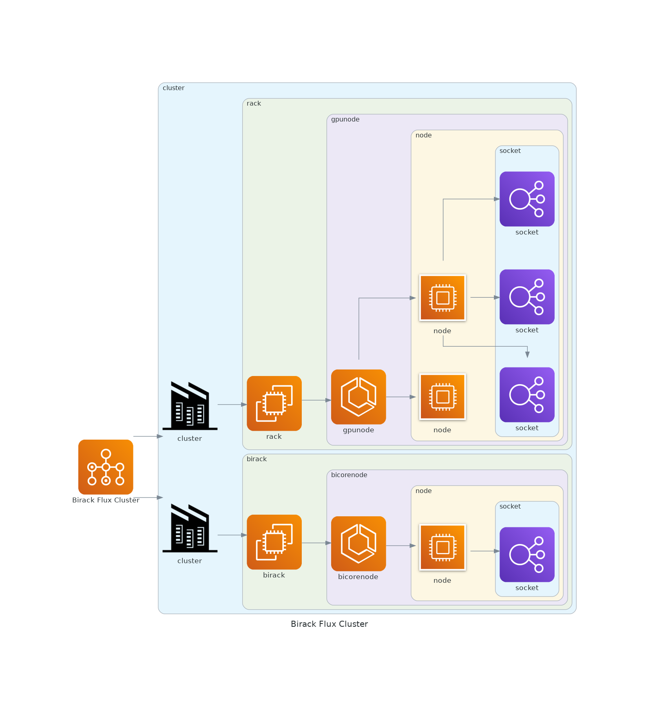
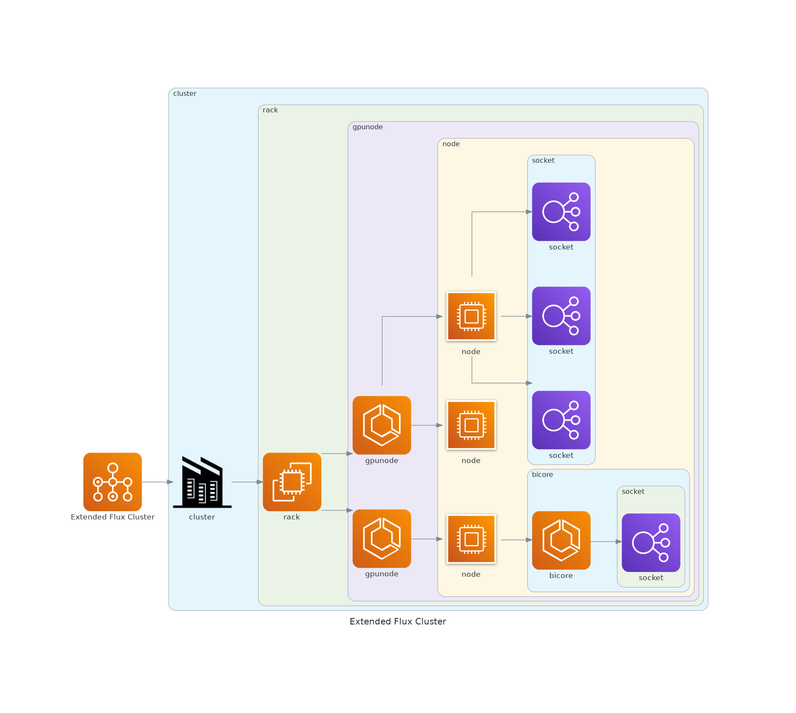

# Diagrams

This is experimenting with [diagrams](https://diagrams.mingrammer.com/docs/getting-started/examples).
If this is an approach we like we can customize the icons and tweak the graph generation (I'm not very good).

```python
python generate.py resources/birack.yaml --root-name "Birack Flux Cluster"
python generate.py resources/simple.yaml
python generate.py resources/cluster.yaml --root-name "Extended Flux Cluster"
```

The icons are wrong here, but we could [make custom ones]() for Flux.

## Examples

  




